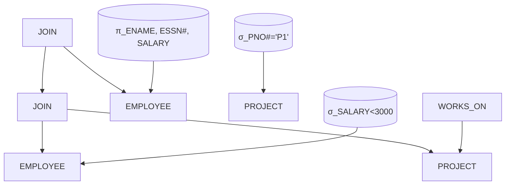

# Environments

- Tauri2.0
  - Vue3, Pinia,
- Spring Web / Node

# 开发计划

```mermaid
graph TD
    A[(σ_SALARY<3000)] --> B[EMPLOYEE]
    C[(π_ENAME, ESSN#, SALARY)] --> D[EMPLOYEE]
    E[(σ_PNO#='P1')] --> F[PROJECT]
    G[WORKS_ON] --> H[PROJECT]
    I[JOIN] --> B
    I --> H
    J[JOIN] --> D
    J --> I
```

